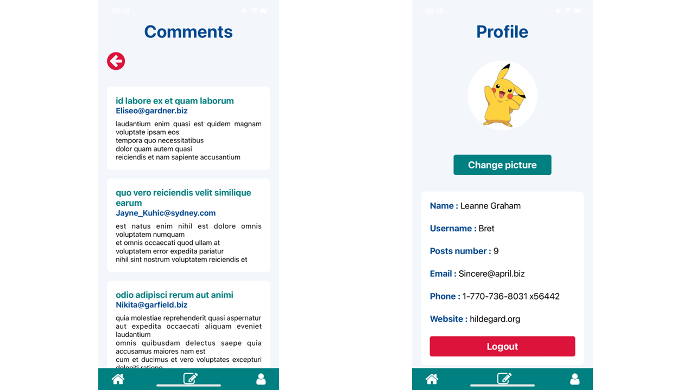

# react-native-blog

This project is a blog created with React Native, using data from JSONPlaceholder API.

## Table of Contents

- [Stack](#stack)
- [Screenshots](#screenshots)
- [Main features](#main-features)
- [Prerequisites](#prerequisites)
- [Recommended tools](#recommended-tools)
- [Use of JSONPlaceholder API](#use-of-jsonplaceholder-api)
- [Run the project locally](#run-the-project-locally)
- [Contributing](#contributing)
- [Stay Updated](#stay-updated)
- [Contact](#contact)

## Stack

This project has been created with React Native and Expo tools.

It uses data fetched from [JSONPlaceholder API](https://jsonplaceholder.typicode.com/).

The application navigation is managed by React Router Native.

## Screenshots

### Login, homepage and create a post

### Comments and profile pages

## Main features

- Fetch data from JSONPlaceholder API.
- Simulate content management (create and delete a post).
- Select a profile photo from the mobile phone gallery or camera.

## Prerequisites

1. Install `Expo` on your device, which is an open-source framework for applications that runs natively on Android, iOS and the web.

To use Expo, you need to have the following tools installed on your machine :

- `Node.js v20.10.0 LTS` ;
- `Git`, for source control ;
- `Watchman` (for Linux or macOS users).

You can find more information on Expo [here](https://docs.expo.dev/get-started/installation/).

2. Install `Expo Go` on your smartphone, which is a free, open-source sandbox app for learning and experimenting with React Native on Android and iOS. [More information](https://docs.expo.dev/get-started/expo-go/).

## Recommended tools

- `Yarn` for faster and more reliable dependency management.
- `VS Code Editor` and `VS Code Expo Extension` for easier debugging and app config autocomplete.
- `PowerShell` (the default terminal in VS Code) or `Bash` via WSL for developers who prefer Windows.

## Use of JSONPlaceholder API

The JSONPlaceholder API is a fake REST API used for testing purposes. It does not support modification operations such as POST, PUT, DELETE.

Therefore, if you want to make full use of this application and actually create or delete a post, you will have to use or create an API that supports CRUD operations.

## Run the project locally

1. Open your terminal and navigate to the location where you want the local repository to be copied.
2. Clone the repository : `git clone https://github.com/jesselessa/react-native-blog.git`
3. Navigate to the project directory : `cd react-native-blog`
4. Install the project dependencies : `yarn install`
5. Start a development server and generate a QR code : `npx expo start` or, if you encounter problems, `npx expo start --tunnel`
6. Scan the QR code with Expo Go (Android) or the Camera app (iOS), in order to run the application in development mode on your smartphone.

## Contributing

Feel free to make improvements, fix bugs, or suggest new features, if you are interested in contributing in the project.

## Stay updated

To stay updated with the project latest changes, you can pull them from the repository : `git pull origin main`

## Contact

For inquiries, you can contact me via [LinkedIn](https://www.linkedin.com/in/jessica-elessa/).

---

&copy; 2024, Jessica ELESSA - All rights reserved
